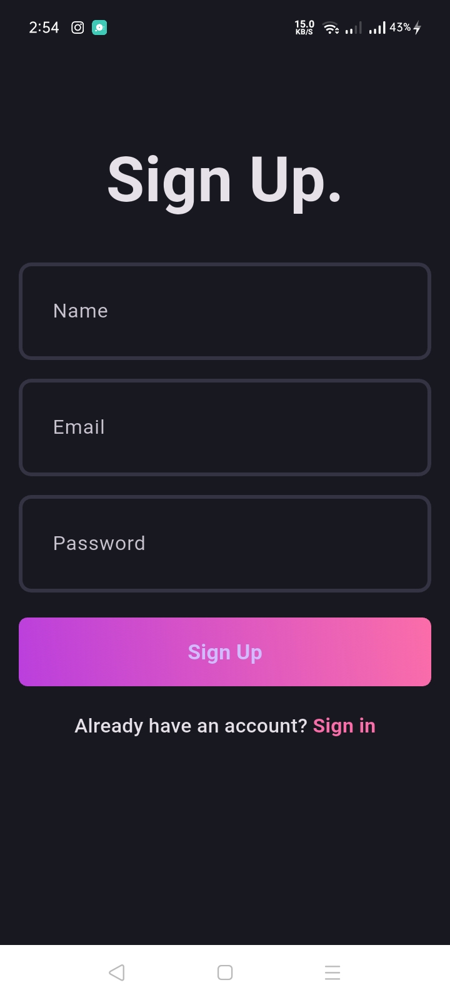
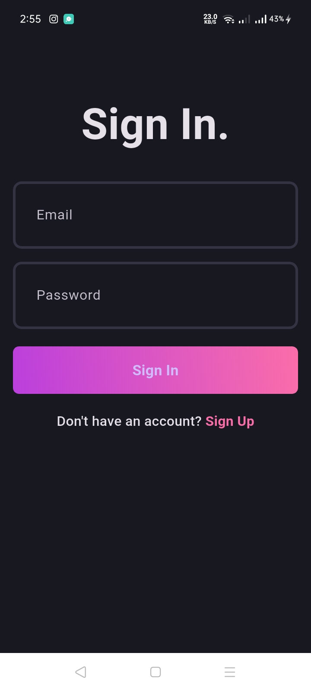
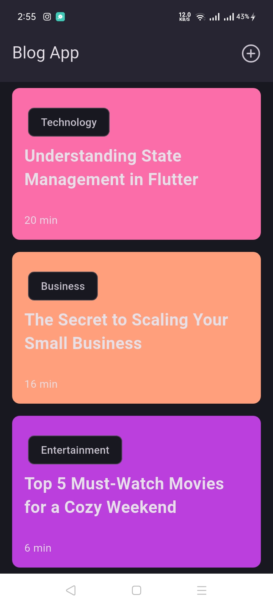
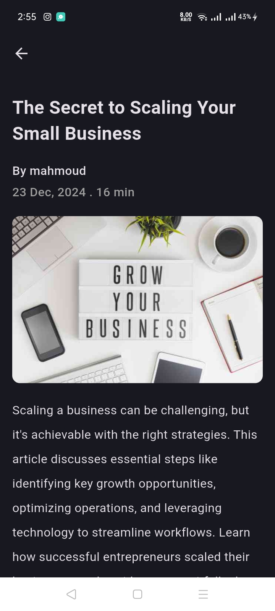
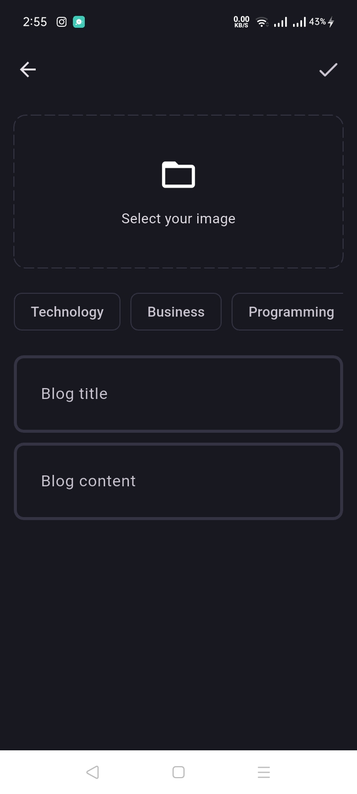

# Blog App

A modern blog application built with **Flutter** and **Supabase**, following **Clean Architecture** and **SOLID Principles** to ensure clean, maintainable, and extendable code.

---

## Clean Architecture
The app is designed using **Clean Architecture** to separate concerns and make the codebase modular:
1. **Presentation Layer**: Handles the UI (widgets) and state management.
2. **Domain Layer**: Contains business logic, entities, and use cases.
3. **Data Layer**: Manages API calls and data storage using Supabase.

---

## Features
- **Authentication**: 
  Login and Sign-up functionality using Supabase.
- **View Blogs**: 
  Display a list of all blogs.
- **Read a Blog**: 
  View individual blogs with a clean and reader-friendly interface.
- **Write Blogs**:
  Create and upload new blogs.
- **Blog Categories**: 
  Choose one or more Categories for your blog.
- **Caching**:
  Offline mode support using Hive to store blogs locally for faster access.

---

## Code Principles
### **SOLID Principles**
1. **Single Responsibility Principle (SRP)**: Each class has a single responsibility, making it easier to test and modify.
2. **Open-Closed Principle (OCP)**: Components are open for extension but closed for modification.
3. **Liskov Substitution Principle (LSP)**: Subclasses can replace their base classes without altering the app's behavior.
4. **Interface Segregation Principle (ISP)**: Interfaces are small and specific to avoid unnecessary dependencies.
5. **Dependency Inversion Principle (DIP)**: High-level modules do not depend on low-level modules. Both depend on abstractions.

### **Extendable Code**
- Modular codebase ensures easy addition of new features (e.g., user profile customization, comments).
- Well-structured folder hierarchy for better scalability.

---

## Tech Stack
- **Frontend**: Flutter
- **Backend**: Supabase
- **State Management**: Bloc / Cubit
- **Database**: Supabase PostgreSQL
- **Caching**: Hive

---

## Screenshots

### Sing Up Page

### Login Page

### Blogs Page

### Blog Viewer Page

### Upload New Blog Page

---

## APKs
[app-arm64-v8a-release](assets/releases/app-arm64-v8a-release.apk)

[armeabi-v7a-release](assets/releases/app-armeabi-v7a-release.apk)

[app-x86_64-release](assets/releases/app-x86_64-release.apk)
